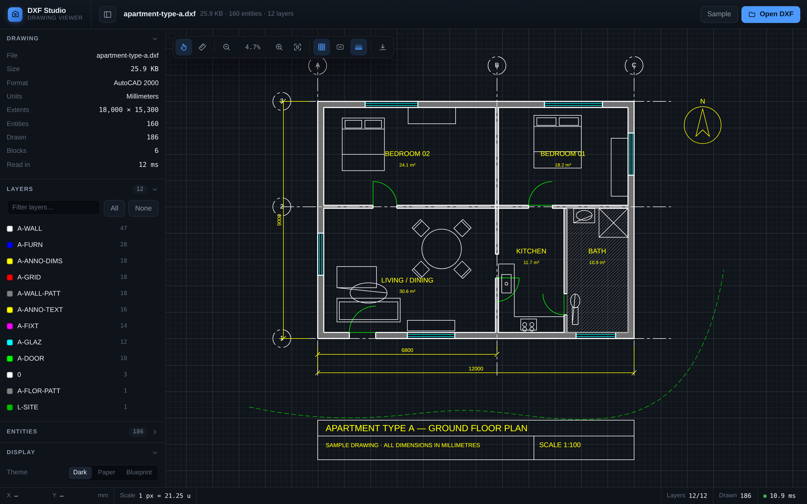

# DXF Studio

Open a DXF drawing in the browser and render it on an HTML canvas — pan, zoom,
toggle layers and measure, with nothing leaving your machine.

Built for looking at architectural drawings: floor plans, sections and details
exported as ASCII DXF from AutoCAD, Revit, BricsCAD, LibreCAD, QCAD or anything
else that writes the format.



## Running it

```bash
npm install
npm run dev      # http://localhost:5173
```

```bash
npm run build    # type-check and bundle to dist/
npm run preview  # serve the production build
npm test         # parser, geometry and camera tests
```

The build is a static bundle — `dist/` can be served from any web host with no
backend.

## What it does

**Reads the drawing.** A DXF parser written for this project walks the HEADER,
TABLES, BLOCKS and ENTITIES sections and produces a document model. Block
references are expanded recursively, `BYLAYER` / `BYBLOCK` inheritance is
resolved to concrete colours and linetypes, and entities on layer `0` inside a
block adopt the layer of the reference, the way AutoCAD does it.

Supported entities:

| | |
|---|---|
| Lines & curves | `LINE`, `LWPOLYLINE`, `POLYLINE`, `ARC`, `CIRCLE`, `ELLIPSE`, `SPLINE` |
| Areas | `SOLID`, `TRACE`, `3DFACE`, `HATCH` (solid and pattern) |
| Annotation | `TEXT`, `MTEXT`, `ATTRIB`, `DIMENSION`, `LEADER` |
| References | `INSERT`, including MINSERT grids and nested blocks |
| Construction | `POINT`, `XLINE`, `RAY` |

Also handled: the full 256-colour AutoCAD Color Index plus true colour, layer
on/off/frozen state, linetype dash patterns, lineweights, the Arbitrary Axis
Algorithm for entities drawn on a non-`+Z` extrusion, and paper-space fallback
when model space is empty.

**Draws it properly.** Curves are never pre-tessellated — a circle is added to
the canvas path as an arc under a world-to-screen transform, so it stays
perfectly round at 10 000 % zoom. Because canvas records path points in device
space, the renderer resets the transform before stroking, which gives
constant-width hairlines, pixel-space dash patterns, and lets consecutive
entities that share a style merge into a single stroke call. Off-screen entities
are culled against their cached bounds.

**Stays out of the way.** Three viewport themes (dark, paper, blueprint), with
drawing colours flipped for contrast when they would otherwise vanish into the
background — the same convention that makes the white pen print black on paper.

## Using it

Drop a `.dxf` file onto the window, or press <kbd>O</kbd>. Files are read with
the File API and parsed in a web worker; nothing is uploaded.

| | |
|---|---|
| <kbd>Drag</kbd> | Pan |
| <kbd>Wheel</kbd> | Zoom at the cursor |
| <kbd>Space</kbd> | Hold to pan from any tool |
| <kbd>F</kbd> | Zoom to extents |
| <kbd>M</kbd> / <kbd>V</kbd> | Measure / pan tool |
| <kbd>G</kbd> <kbd>L</kbd> <kbd>T</kbd> | Grid / lineweights / text |
| <kbd>Esc</kbd> | Clear the measurement or layer isolation |
| <kbd>O</kbd> | Open a file |

The measure tool snaps to endpoints, midpoints, centres and quadrants, and
reports distance, ΔX, ΔY and bearing. The layer panel toggles visibility,
isolates a single layer, and shows each layer's colour and object count. The
current view exports to PNG at 2× resolution.

## How it is put together

```
src/
  dxf/
    tokenizer.ts     group-code stream and the cursor over it
    parser.ts        sections, entities, MTEXT decoding
    geometry.ts      affine transforms, bulge arcs, NURBS evaluation
    scene.ts         block expansion, colour resolution, bounds
    loader.ts        text -> drawing, plus the sidebar's summary figures
    parse.worker.ts  keeps parsing off the main thread
    colors.ts        AutoCAD Color Index palette
  render/
    renderer.ts      canvas drawing, stroke batching, culling
    view.ts          the 2D camera
    snap.ts          object snapping for the measure tool
    theme.ts         viewport colour schemes
  components/        React shell: viewport, sidebar, toolbar, status bar
  samples/
    floorPlan.ts     the built-in sample, written as real DXF text
```

The sample plan is generated as ASCII DXF at runtime and read back through the
normal pipeline, so it exercises the parser rather than bypassing it.

## Known limits

- **ASCII DXF only.** Binary DXF is detected and reported with instructions to
  re-export; DWG is a different format entirely and is not supported.
- **Top view.** Everything is projected to the XY plane. 3D solids and meshes
  (`3DSOLID`, `MESH`, `POLYLINE` surfaces) are skipped and listed in a warning
  rather than drawn wrong.
- **Hatch patterns are approximated.** A DXF names its pattern (`ANSI31`) but
  does not carry the `.pat` definition, so non-solid hatches are drawn as evenly
  spaced rules at the stored angle and scale. Solid hatches are exact.
- **Fonts are substituted.** SHX shape fonts are not embedded in a DXF, so text
  is drawn with a system sans-serif at the correct height, rotation, oblique
  angle and width factor.
